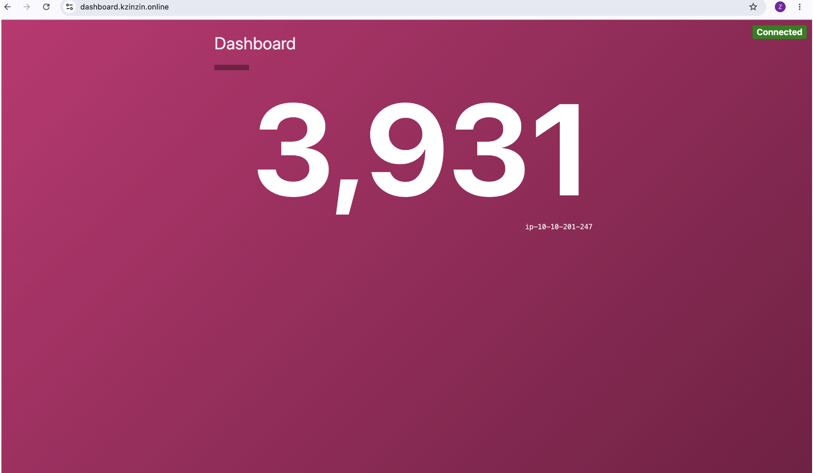
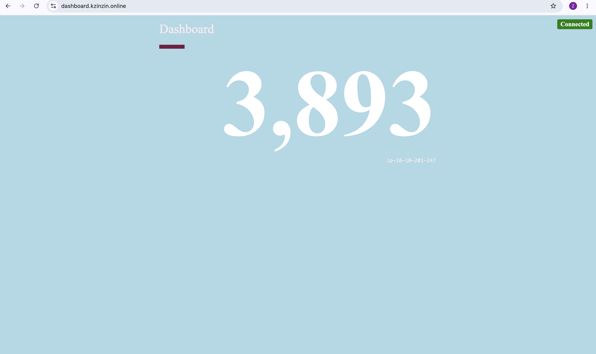

# Blue/Green Layout — Dashboard v0.1.0 ↔ v0.2.0

## Concept
Two identical Dashboard ASGs always running. Public ALB routes by host-header.

| Colour | Version | Notes |
|---|---|---|
| Blue  | v0.1.0 | Original |
| Green | v0.2.0 | Light-blue bg, Times New Roman |

| Blue (v0.1.0) | Green (v0.2.0) |
|:---:|:---:|
|  |  |

## Layout

```
VPC 10.10.0.0/16
├── Public (3 AZs): 10.10.1.0/24, 10.10.2.0/24, 10.10.3.0/24
│ ├── Jump host (EC2 + SSH key) — public subnet 1
│ └── Public ALB (HTTPS, host-header) — all 3
│ ├── dashboard-blue.<domain> -> blue TG (v0.1.0)
│ └── dashboard-green.<domain> -> green TG (v0.2.0)
├── Private 1-2: 10.10.101.0/24, 10.10.102.0/24 -> dashboard-blue-asg (v0.1.0)
├── Private 3-4: 10.10.103.0/24, 10.10.104.0/24 -> dashboard-green-asg (v0.2.0)
└── Private 5-6: 10.10.201.0/24, 10.10.202.0/24 -> counting-asg
└── Internal ALB -> counting.internal.local (private R53 zone)
```

## Traffic

```
Internet -> ALB :443 (blue/green host headers)
-> dashboard-blue-tg :8080 (v0.1.0) | dashboard-green-tg :8080 (v0.2.0)
-> counting.internal.local:8080 (internal ALB)
-> counting-tg :8080 (counting-asg)
```


## SSH

```
jump -> dashboard-blue
jump -> dashboard-green
dashboard-blue -> counting
dashboard-green -> counting
```

No direct jump -> counting. 4 key pairs: jump, dashboard_v1 (blue), dashboard_v2 (green), counting.

## ASGs (each CPU target-tracking)
| ASG | Subnets | Script | Release |
|---|---|---|---|
| dashboard-blue-asg  | priv 1,2 | scripts/dashboard_v1.sh | v0.1.0 |
| dashboard-green-asg | priv 3,4 | scripts/dashboard_v2.sh | v0.2.0 |
| counting-asg        | priv 5,6 | scripts/count.sh        | v0.1.0 |

Both dashboards run permanently — no teardown on cutover.

## Files
- variables.tf, data.tf, version.tf
- vpc.tf             — VPC, IGW, 3 public + 6 private, 1 shared NAT
- keypair.tf         — jump SSH key
- jumphost.tf        — bastion EC2 + EIP
- security_groups.tf — jump, alb, dashboard-blue, dashboard-green, counting-alb, counting
- acm.tf             — 1 cert, SANs for dashboard-blue/green, DNS validated
- route53.tf         — public blue/green aliases + private zone + counting record
- alb.tf             — public ALB (2 host rules) + internal ALB
- launch_templates.tf, asg.tf — 3 ASGs
- outputs.tf
- scripts/dashboard_v1.sh — installs dashboard-service v0.1.0, counting key, systemd unit
- scripts/dashboard_v2.sh — same, v0.2.0
- scripts/count.sh        — installs counting-service v0.1.0, systemd unit

## Workflow
1. `terraform apply` -> both blue + green come up.
2. Test green: `https://dashboard-green.<domain>` (health, counting reachability).
3. Cutover:
   - **Header swap**: change ALB listener rule to green TG (instant, no DNS TTL).
   - **Weighted R53**: `dashboard.<domain>` blue/green weights 100→0 (canary).
4. Rollback: flip rule/weight back (blue never scaled down).
5. Retire blue (optional): `desired_capacity = 0`, keep LT + keypair.

## Before You Apply
1. `terraform.tfvars` -> set `domain_name` (needs existing PUBLIC R53 zone).
2. `admin_cidr` -> your real IP/32 (placeholder 0.0.0.0/0 is unsafe).
3. Scripts already contain real install logic (releases v0.1.0 / v0.2.0 / v0.1.0).
4. Health check path `/` for both ALBs — override `dashboard_health_check_path` /
   `counting_health_check_path` if services don't return 2xx/3xx.
5. Choose cutover: `blue_green_switch = "header" | "weighted"`; set
   `blue_weight` / `green_weight` if weighted.

## SSH Keys
```bash
terraform output -raw jump_host_private_key_pem   > jump.pem
terraform output -raw dashboard_v1_private_key_pem > dashboard_blue.pem
terraform output -raw dashboard_v2_private_key_pem > dashboard_green.pem
terraform output -raw counting_private_key_pem     > counting.pem
chmod 400 jump.pem dashboard_blue.pem dashboard_green.pem counting.pem

Host jump
    HostName <jump_host_public_ip>
    User ubuntu
    IdentityFile ~/.ssh/jump.pem

Host dashboard-blue
    HostName <dashboard_blue_private_ip>
    User ubuntu
    ProxyJump jump
    IdentityFile ~/.ssh/dashboard_blue.pem

Host dashboard-green
    HostName <dashboard_green_private_ip>
    User ubuntu
    ProxyJump jump
    IdentityFile ~/.ssh/dashboard_green.pem

Host counting-via-blue
    HostName <counting_private_ip>
    User ubuntu
    ProxyJump dashboard-blue
    IdentityFile ~/.ssh/counting.pem

Host counting-via-green
    HostName <counting_private_ip>
    User ubuntu
    ProxyJump dashboard-green
    IdentityFile ~/.ssh/counting.pem